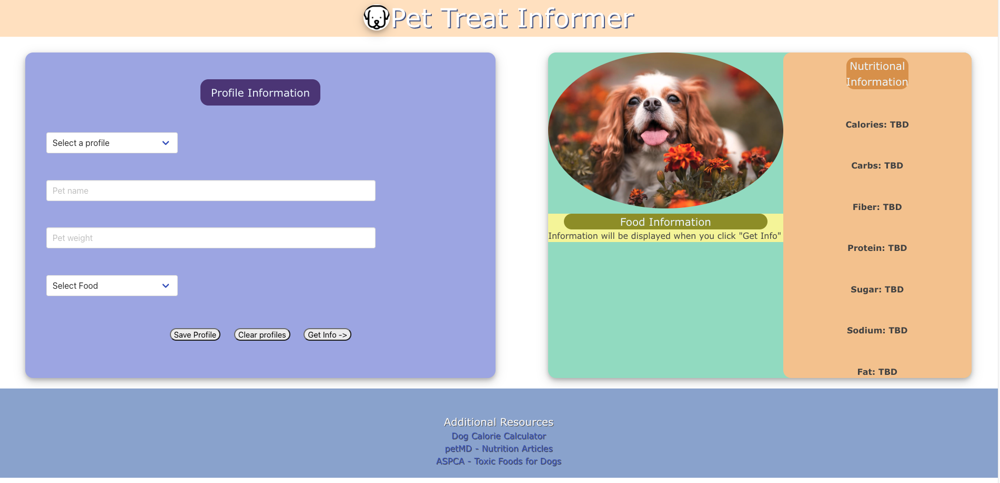

# Creating our Pet Treat Informer Page

## Description

- We wated to create a website where dog owners can search up common human foods they might want to feed thier dogs. We want to provide nutritional information on those foods and also give general information on it.
- We wanted to be able to have a simple website that a person can navigate to make searching for nutrition information easier. 
- The website can make it easier for people to serch if they can feed their dog a common human food without having to search through multiple pages to look for information. It will also display a warning on foods that casue harmful side effects if consumed.

## Deployed Website
### https://stephenrossetti.github.io/Project-1 

## Installation

There is no special installation required. The user only has to have the link to aces the website.

## Usage

The page includes two boxes where the user will input their dogs name in one box and the weight in the other. The user will be able to select a food item from the list provided in a different box. Saving the profile will be helpful to the users that want to keep their information for future uses, and they can also delete their profile if they no longer want it saved. The get info button with provide the information on the left of the website for the user.

## Credits
- Stevie Rossetti https://github.com/stephenrossetti 
- Adam Boudraa https://github.com/adamboudruh
- Logan Patrick https://github.com/LogOfPat
- Lizet Vargas https://github.com/Lichivargas

## License

MIT License

Copyright (c) [2023] [Stevie Rossetti, Adam Boudraa, Logan Patrick, Lizet Vargas]

Permission is hereby granted, free of charge, to any person obtaining a copy
of this software and associated documentation files (the "Software"), to deal
in the Software without restriction, including without limitation the rights
to use, copy, modify, merge, publish, distribute, sublicense, and/or sell
copies of the Software, and to permit persons to whom the Software is
furnished to do so, subject to the following conditions:

The above copyright notice and this permission notice shall be included in all
copies or substantial portions of the Software.

THE SOFTWARE IS PROVIDED "AS IS", WITHOUT WARRANTY OF ANY KIND, EXPRESS OR
IMPLIED, INCLUDING BUT NOT LIMITED TO THE WARRANTIES OF MERCHANTABILITY,
FITNESS FOR A PARTICULAR PURPOSE AND NONINFRINGEMENT. IN NO EVENT SHALL THE
AUTHORS OR COPYRIGHT HOLDERS BE LIABLE FOR ANY CLAIM, DAMAGES OR OTHER
LIABILITY, WHETHER IN AN ACTION OF CONTRACT, TORT OR OTHERWISE, ARISING FROM,
OUT OF OR IN CONNECTION WITH THE SOFTWARE OR THE USE OR OTHER DEALINGS IN THE
SOFTWARE.

---
